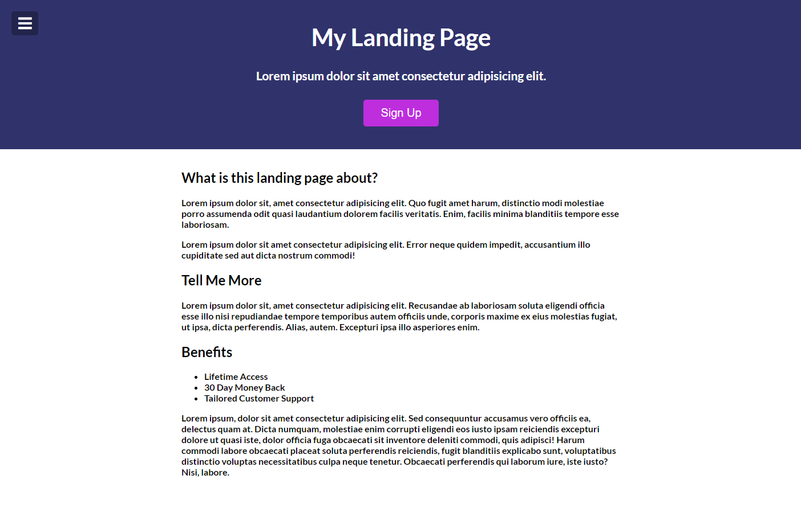
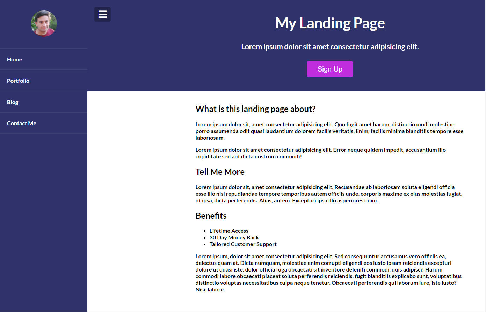
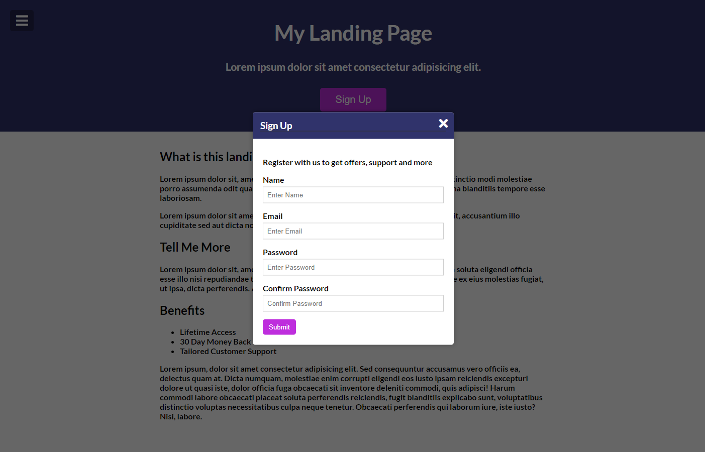

# Menu Slider & Modal  DOM & CSS
 
 O objetivo deste projeto foi reforçar os conhecimentos em HTML, CSS e JavaScript sendo criado um Menu slider e Modal.

## Home

 

## Nav Open

 

## Modal Open

 

## Preview Live

https://robsonvinicius.github.io/menu-slider.modal/
